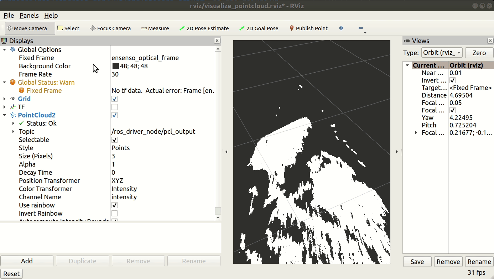

# **What Is This?** :no_entry:

**Unofficial** ROS2 driver for [Ensenso](http://www.ensenso.com) stereo cameras.

This package is very much a **Work In Progress** with no assurance to quality standards achieved by the parent repository.

### `Follow the instructions below at your own risk.`

# Environment
1. Ubuntu 18.04
2. PCL 1.8.1
3. ROS2 Eloquent

# Setup :hammer:

```bash
cd $HOME
git clone --recursive https://github.com/cardboardcode/ros_driver.git --depth 1 --single-branch --branch ros2 --single-branch
cd ros_driver/ros_driver
bash scripts/install_deps.bash
bash scripts/build.bash
```

# **Run**
```bash
# Connect Ensenso N35 Camera.
cd $HOME
cd ros_driver/ros_driver
bash scripts/run.bash

# Open new terminal.
cd $HOME
cd ros_driver/ros_driver
bash scripts/visualize.bash
```
You should then see something like this:


# **Other Information**

Development of this ROS2 driver is currently tracked using [Issue #64](https://github.com/ensenso/ros_driver/issues/64#issuecomment-859310549).
